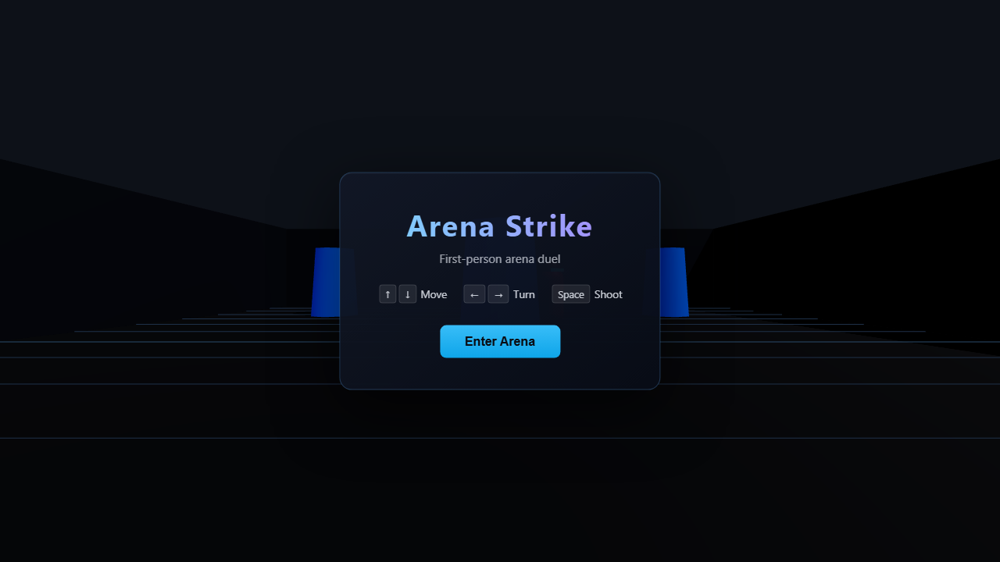
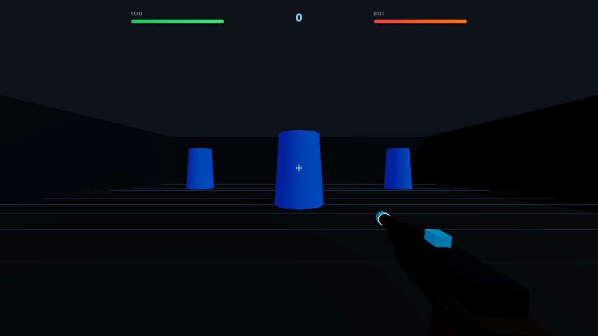

# Arena Strike

A browser-based **3D first-person arena shooter** built with [Three.js](https://threejs.org/). Fight one AI opponent in a compact sci-fi arena—move with the arrow keys and shoot with the space bar.

## Screenshots

### Main menu


### Gameplay


### Shooting


## Requirements

- A modern browser (Chrome, Edge, Firefox, or Safari)
- [Node.js](https://nodejs.org/) (optional, only needed to run a local web server)

> **Note:** Open the game through a local server, not by double-clicking `index.html`. The game loads Three.js as an ES module, which browsers block on `file://` URLs.

## How to run

### Option 1 — `npx serve` (recommended)

From this folder (`FPS-Shooter-Game`):

```bash
npx serve -l 8080
```

Then open **http://localhost:8080** in your browser.

### Option 2 — Python

```bash
# Python 3
python -m http.server 8080
```

Then open **http://localhost:8080**.

### Option 3 — VS Code / Cursor

Use the **Live Server** extension and open `index.html`.

## Controls

| Key | Action |
|-----|--------|
| **↑** / **↓** | Move forward / backward |
| **←** / **→** | Turn left / right |
| **Space** | Shoot |

Click **Enter Arena** on the menu to start. Reduce the bot’s health to zero to win.

## Project structure

```
FPS-Shooter-Game/
├── index.html      # Page shell and UI overlay
├── style.css       # Menu, HUD, and overlay styles
├── game.js         # Three.js game logic
├── screenshots/    # README preview images
└── scripts/        # Dev utilities (screenshot capture)
```

## Regenerating screenshots (optional)

If you change the UI and want new README images:

```bash
npx serve -l 8080
# In another terminal:
npm install playwright
npx playwright install chromium
set GAME_URL=http://localhost:8080   # Windows
node scripts/capture-screenshots.mjs
```

## Tech stack

- Three.js (via CDN import map)
- Vanilla HTML / CSS / JavaScript (no build step)
