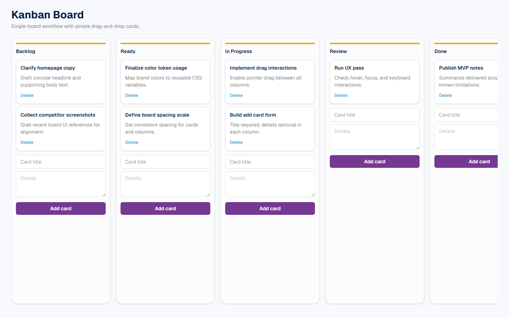
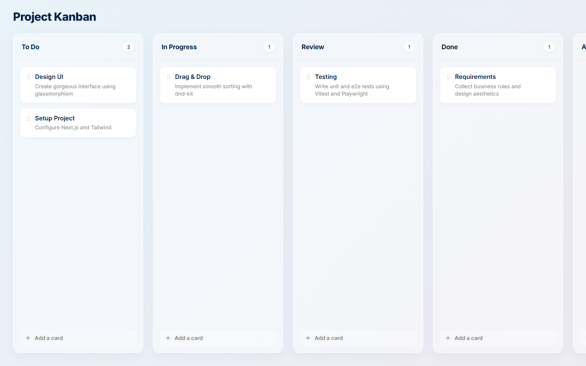

# Instant — Vibe Coding Experiments

This repository is my **vibe coding** playground: a place to explore ideas quickly, ship small projects, and lean on **AI agents** (Cursor, Copilot, and similar tools) to help design, implement, and iterate—not to replace thinking, but to move faster from “what if?” to something you can run in a browser or terminal.

Each folder here is typically a self-contained experiment. I’ll add new projects over time as agents and I build them together.

---

## Projects

### 1. [Arena Strike](FPS-Shooter-Game/) — 3D FPS (first project)

My first build in this repo: a **browser-based 3D first-person arena shooter** made with Three.js. You face one AI bot in a compact sci-fi arena—arrow keys to move and turn, space bar to shoot.

| | |
|---|---|
| **Stack** | Three.js, vanilla HTML/CSS/JS |
| **Run** | `cd FPS-Shooter-Game && npm start` → open http://localhost:8080 |
| **Docs** | [FPS-Shooter-Game/README.md](FPS-Shooter-Game/README.md) |

---

### 2. [Kanban](kanban/) -- Single-board Kanban (Cursor)

A **single-board Kanban project management app** built entirely with Cursor. Five renamable columns, drag-and-drop cards via dnd-kit, inline add/delete -- no persistence, no auth, just a clean board that opens pre-populated with sample data.

| | |
|---|---|
| **Stack** | Next.js 16, React 19, dnd-kit, Tailwind CSS 4 |
| **Run** | `cd kanban/frontend && npm install && npm run dev` |
| **Docs** | [kanban/README.md](kanban/README.md) |

---

### 3. [Kanban Gemini](kanban_gemini/) -- Single-board Kanban (Gemini)

The **same Kanban spec rebuilt with Gemini** as a head-to-head comparison. Identical feature set -- five columns, drag-and-drop, add/delete cards -- but coded by a different agent using vanilla CSS and Lucide icons instead of Tailwind.

| | |
|---|---|
| **Stack** | Next.js 16, React 19, dnd-kit, Lucide React, vanilla CSS |
| **Run** | `cd kanban_gemini/frontend && npm install && npm run dev` |
| **Docs** | [kanban_gemini/frontend/README.md](kanban_gemini/frontend/README.md) |

---

## How this repo works

- **Vibe coding** — start with a rough goal, iterate in the open, favor working demos over perfect architecture.
- **Agent-assisted** — prompts and agents handle boilerplate, 3D setup, UI polish, and docs; I steer direction and review what ships.
- **One folder per experiment** — easy to clone, run, or archive without touching other projects.

More experiments will show up here as they land.
